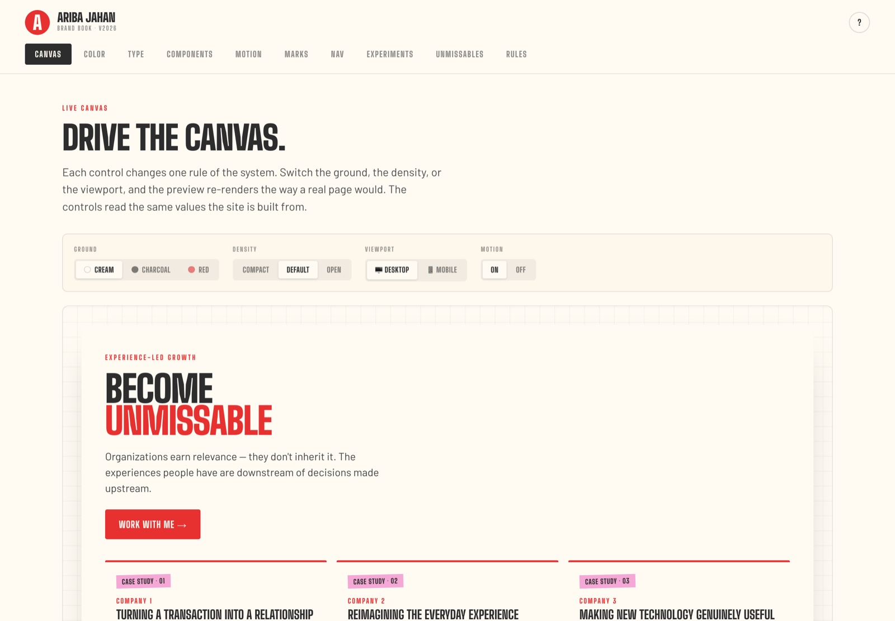

# Ariba Jahan — Brand Book

The living brand book behind [aribajahan.com](https://aribajahan.com) — the palette,
type scale, signature motifs, components, and motion rules that make the site read as one
system. It's a single, self-contained interactive page, built in the language it documents:
every color, type size, and component on the page is also holding the page up.

**Live:** [design.aribajahan.com](https://design.aribajahan.com), or open `index.html` in a browser — no build step, no dependencies.

## What's in it

A browsable app with six views, switched from the top nav:

- **Canvas** — a live preview you drive. Flip **Ground** (cream / charcoal / red),
  **Density** (compact / default / open), **Viewport** (desktop / mobile), and **Motion**
  (on / off), and the preview re-renders under the same rules the real site follows.
- **Color** — the four structural colors and four reserved accents. Click any swatch to
  copy its hex.
- **Type** — the fixed type scale as live specimens, plus a slider to preview the display
  face at any size.
- **Components** — cards, buttons, tape pills, testimonials, and a flip card, with a state
  toggle that forces hover and press without a mouse.
- **Motion** — replayable demos of the marquee, the card lift, the tape settle, and the flip.
- **Rules** — the spacing spec and the seven moves for building a new page.

## The system, in one paragraph

Three structural colors — cream `#FFFBF3`, charcoal `#2D2D2D`, cherish red `#E73131` —
carry the whole site, rotating as section grounds so no more than two same-tone sections
sit in a row. Four accents (tennis green, femme pink, tangerine, highlighter) appear only
where each is reserved. Headlines, numerals, and labels are set in Big Shoulders Display at
heavy weights; Barlow does all the reading, with a 16px floor. Motion lives in continuous
ambient loops and the feedback of touch. Nothing is parked offscreen waiting to reveal
itself.

## Stack

Plain HTML, CSS, and vanilla JavaScript. Fonts from Google Fonts (Big Shoulders Display +
Barlow). No framework, no build. The next step is porting it to a `/design` route on the
Next.js site.

## Type

- **Display / headlines / numerals / labels:** Big Shoulders Display — 700 / 800 / 900,
  uppercase, tight tracking.
- **Body:** Barlow — 400 / 500 / 600 + italic 400, 16px floor.
